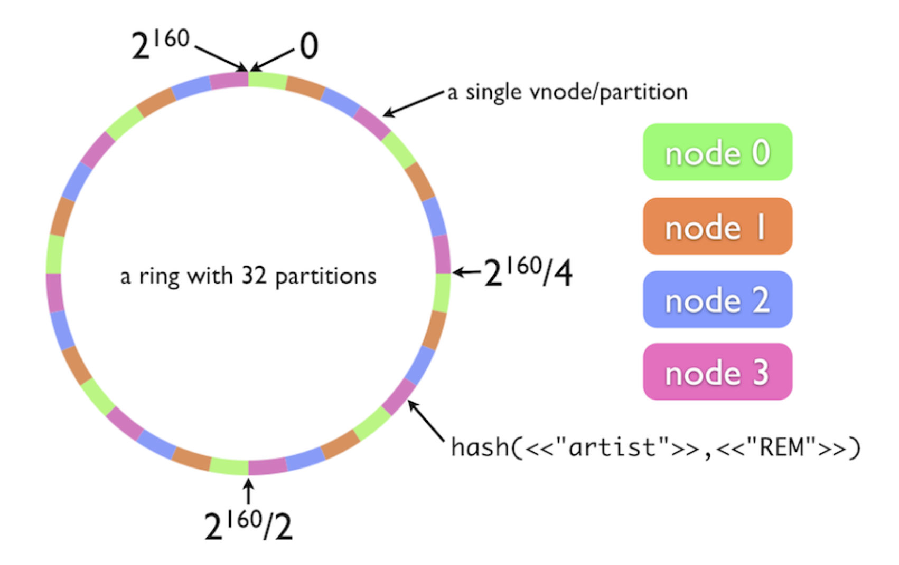

# Riak Core Tutorial

A basic example of a riak_core application, using the most
recent version of the [riak_core_ng fork](https://hex.pm/packages/riak_core_ng)
and running on Erlang/OTP 20 with rebar3.

This example was largely based on the
[Little Riak Core Book](https://marianoguerra.github.io/little-riak-core-book/)
and the
[Create a riak_core application in Elixir](https://medium.com/@GPad/create-a-riak-core-application-in-elixir-part-1-41354c1f26c3)
series.

The code on this repository can be used directly by cloning it; see [Usage](/#usage)
for example commands. Alternatively,
the [Tutorial](/#riak-core-tutorial) explains the step-by-step process to
produce the same code base from scratch.

   * [Riak Core Tutorial](#riak-core-tutorial)
      * [Example application usage](#example-application-usage)
      * [Riak Core Tutorial](#riak-core-tutorial-1)
         * [When to use Riak Core](#when-to-use-riak-core)
         * [About this tutorial](#about-this-tutorial)
         * [Useful links](#useful-links)
         * [0. Riak Core overview](#0-riak-core-overview)
         * [1. Setup](#1-setup)
         * [2. The vnode](#2-the-vnode)
            * [The riak_vnode behavior](#the-riak_vnode-behavior)
            * [Application and supervisor setup](#application-and-supervisor-setup)
            * [Sending commands to the vnode](#sending-commands-to-the-vnode)
         * [3. Setting up the cluster](#3-setting-up-the-cluster)
         * [4. Building a distributed Key/Value store](#4-building-a-distributed-keyvalue-store)
         * [5. Testing](#5-testing)
         * [6. Coverage commands](#6-coverage-commands)
            * [Handle coverage commands in the vnode](#handle-coverage-commands-in-the-vnode)
            * [The coverage FSM](#the-coverage-fsm)
            * [Coverage FSM Supervision](#coverage-fsm-supervision)
            * [Putting it all together](#putting-it-all-together)
            * [Coverage test](#coverage-test)
         * [7. Redundancy and fault-tolerance](#7-redundancy-and-fault-tolerance)
         * [8. Handoff](#8-handoff)
            * [When does handoff occur?](#when-does-handoff-occur)
            * [Vnode implementation](#vnode-implementation)
            * [Handoff test](#handoff-test)

## Example application usage
Run on three separate terminals:

``` shell
make dev1
make dev2
make dev3
```

Join the nodes and ping:

``` erlang
(rc_example1@127.0.0.1)1> riak_core:join('rc_example2@127.0.0.1').
(rc_example1@127.0.0.1)2> riak_core:join('rc_example3@127.0.0.1').
(rc_example1@127.0.0.1)3> rc_example:ping().
```

Check the ring status:

``` erlang
(rc_example3@127.0.0.1)4> rc_example:ring_status().
```

Try the key/value commands:

``` erlang
(rc_example1@127.0.0.1)1> rc_example:put(k1, v1).
ok
(rc_example1@127.0.0.1)2> rc_example:put(k2, v2).
ok
(rc_example2@127.0.0.1)1> rc_example:get(k2).
v2
```

## Riak Core Tutorial

[Riak Core](https://github.com/basho/riak_core) is the distributed
systems framework used by the [Riak data store](https://github.com/basho/riak)
to distribute data and scale. More generally, it can be thought of as
a toolkit for building distributed, scalable, fault-tolerant
applications. In practical terms, Riak Core is an Erlang/OTP application, and most
of the user defined work is done in the `riak_core_vnode` behavior.

### When to use Riak Core

What makes Riak Core so interesting and useful is that it implements
the ideas of the
[Amazon's Dyamo](https://en.wikipedia.org/wiki/Dynamo_(storage_system))
architecture and exposes its infrastructure as
a reusable library, allowing to easily apply them in any context that
can benefit from decentralized distribution of work (including but not
limited to data stores).

As you will see, it provides the basic blocks to build distributed services, consistent hashing, routing, support for sharding and replicating, distributed queries, etc. They need not all be used. For example, a game server which handles requests from players could partition players to handle load, and ensure that players requests are always handled on the same vnode to ensure data locality.

A distributed batch job handling system could also use consistent hashing and routing to ensure jobs from the same batch are always handled by the same node, or distribute the jobs across several partitions and then use the distributed map-reduce queries to gather results.

### About this tutorial

Basho, the company that originally developed Riak and Riak Core was
put into receivership in 2017. This introduces some uncertainty about the
future of these products, although the community has shown interest in
taking over their maintenance. At the moment of writing,
the [riak_core_ng](https://github.com/Kyorai/riak_core) fork seems to
be the most actively maintained fork of Riak Core and hopefully the work being
done there will eventually be merged back to the canonical repository.

As part of our interest in this technology and our intention to use it
in new projects we had to struggle a bit with scarce and outdated
documenatation, stale dependencies, etc. The intention is thus to
provide a tutorial on how to use Riak Core today, on an Erlang 20
and rebar3 project, with minimal dependencies and operational
sugar. You'll notice the structure borrows heavily from
the
[Little Riak Core Book](https://marianoguerra.github.io/little-riak-core-book/)
and the
[riak_core in Elixir](https://medium.com/@GPad/create-a-riak-core-application-in-elixir-part-1-41354c1f26c3)
series, which were our main references.

### Useful links
* [Introducing Riak Core](http://basho.com/posts/business/introducing-riak-core/)
* [Riak Core Wiki](https://github.com/basho/riak_core/wiki)
* [Masterless Distributed Computing with Riak Core](http://www.erlang-factory.com/upload/presentations/294/MasterlessDistributedComputingwithRiakCore-RKlophaus.pdf)
* Ryan Zezeski's "working" blog:
  [First, multinode](https://github.com/rzezeski/try-try-try/tree/master/2011/riak-core-first-multinode) and
  [The vnode](https://github.com/rzezeski/try-try-try/tree/master/2011/riak-core-the-vnode)
* [Little Riak Core Book](https://marianoguerra.github.io/little-riak-core-book/)
* riak_core in Elixir:
  [Part I](https://medium.com/@GPad/create-a-riak-core-application-in-elixir-part-1-41354c1f26c3),
  [Part II](https://medium.com/@GPad/create-a-riak-core-application-in-elixir-part-2-88bdec73f368),
  [Part III](https://medium.com/@GPad/create-a-riak-core-application-in-elixir-part-3-8bac36632be0),
  [Part IV](https://medium.com/@GPad/create-a-riak-core-application-in-elixir-part-4-728512ece224) and
  [Part V](https://medium.com/@GPad/create-a-riak-core-application-in-elixir-part-5-86cd9d2c6b92)
* [A Gentle Introduction to Riak Core](http://efcasado.github.io/riak-core_intro/)
* Understanding Riak Core:
  [Handoff](http://basho.com/posts/technical/understanding-riak_core-handoff/),
  [Building Handoff](http://basho.com/posts/technical/understanding-riak_core-building-handoff/)
  and
  [The visit fun](http://basho.com/posts/technical/understanding-riak_core-visitfun/)
* [udon_ng](https://github.com/mrallen1/udon_ng) example application.


### 0. Riak Core overview

Riak Core is based on the Dynamo architecture, meaning it
scales and distributes the work in a decentralized manner, using
[Consistent Hashing](https://en.wikipedia.org/wiki/Consistent_hashing).

Most operations are applied to an object which is identified by some
data value. In the context of a Key/Value store, for example, the
identifier is the Key used in get, put and delete operations.

Before performing the operation, a hashing function is applied to
the key. The key hash will be used to decide which node in the
cluster should be responsible for executing the operation. The range of
possible values the key hash can take (the keyspace, usually
depicted as a ring), is partitioned in equally sized buckets, which
are assigned to virtual nodes, also known as vnodes.



The number of vnodes is fixed at cluster creation and a given hash value will
always belong to the same partition (i.e. the same vnode). The vnodes in
turn are evenly distributed across all available physical nodes.
Note this distribution isn't fixed as the keyspace partitioning
is: the vnode distribution can change if a physical node is added
to the cluster or goes down.

### 1. Setup

In this tutorial we'll build an in-memory, distributed key/value
store. Let's start by creating a new project with rebar3:

``` shell
$ rebar3 new app rc_example
===> Writing rc_example/src/rc_example_app.erl
===> Writing rc_example/src/rc_example_sup.erl
===> Writing rc_example/src/rc_example.app.src
===> Writing rc_example/rebar.config
===> Writing rc_example/.gitignore
===> Writing rc_example/LICENSE
===> Writing rc_example/README.md
```

Note there's a
[rebar3 template for riak core](https://github.com/marianoguerra/rebar3_template_riak_core). The
reason we don't use
it here is that it's outdated and it generates a lot of operational
code that would take a lot of effort to figure out and fix. Instead,
we'll start with an empty project and build our way up, although the
code generated by the template can serve as a good reference along the
way.

Next up we'll fill up some of the rebar.config file. We'll add the
riak_core dependency and lager, which we'll use for logging:

``` erlang
{erl_opts, [debug_info, {parse_transform, lager_transform}]}.
{deps, [{riak_core, "3.0.9", {pkg, riak_core_ng}}, {lager, "3.5.1"}]}.
```

Note we're using
the [`riak_core_ng` fork](https://hex.pm/packages/riak_core_ng), which is
more up to date so it's easier to make it work with Erlang 20. If you
go ahead and try to `rebar3 compile` your project, you'll notice it
fails with this message:

``` shell
===> Compiling _build/default/lib/riak_ensemble/src/riak_ensemble_test.erl failed
_build/default/lib/riak_ensemble/src/riak_ensemble_test.erl:21: export_all flag enabled - all functions will be exported
```

The issue here is that some of the dependencies of riak_core use
the [warnings_as_errors option](http://erlang.org/doc/man/compile.html),
and their code contains stuff
that produces warnings in recent Erlang versions (namely, they use
`export_all` or `gen_fsm`). To fix this we need to override their
configuration in our rebar.config file, removing the `warnings_as_errors` option:

``` erlang
{overrides, [{override, riak_ensemble,
              [{erl_opts, [debug_info,
                           warn_untyped_record,
                           {parse_transform, lager_transform}]}]},

             {override, riak_core,
              [{erl_opts, [{parse_transform, lager_transform},
                           debug_info, {platform_define, "^[0-9]+", namespaced_types},
                           {platform_define, "18", old_rand},
                           {platform_define, "17", old_rand},
                           {platform_define, "^R15", old_hash}]}]},

             {override, poolboy,
              [{erl_opts, [debug_info,
                           {platform_define, "^[0-9]+", namespaced_types}]}]}]}
```

Now that the project compiles, let's try to build and run a
release. First we need to add lager and riak_core to
`src/rc_example.app.src`, so they're started along with our
application. We also need to add cuttlefish, which is a system riak uses
for its internal configuration:

``` erlang
  {applications,
   [kernel,
    stdlib,
    lager,
    cuttlefish,
    riak_core
   ]}
```

Then, add the [release configuration](https://www.rebar3.org/docs/releases) for
development in `rebar.config`:

``` erlang
{relx, [{release, {rc_example, "0.1.0"}, [rc_example]},
        {dev_mode, true},
        {include_erts, false},
        {sys_config, "conf/sys.config"},
        {vm_args, "conf/vm.args"},
        {extended_start_script, false}]}.
```

Note we won't be using the rebar3 shell command, which doesn't play
along nicely with riak_core; we need a proper release instead (although we can
use dev_mode). Thus, we can build and run the release with:

    $ rebar3 release && _build/default/rel/rc_example/bin/rc_example

If you go ahead and run that you'll see an error like `Failed to load
ring file: "no such file or directory"`. We need to add some configuration to
`conf/sys.config` and `conf/vm.args` to properly start riak_core:

``` erlang
%% vm.args
-name rc_example@127.0.0.1

%% conf/sys.config
[{riak_core,
  [{ring_state_dir, "./data/ring"},
   {web_port, 8098},
   {handoff_port, 8099},
   {schema_dirs, ["priv"]}
  ]}].
```

`vm.args` just sets the node name; in `sys.config` we set a data
directory for riak core (`ring_state_dir`) and a
couple of ports; we also need to point riak to its schema (by setting
`schema_dirs`). For this to work we have to copy
[this file](https://github.com/Kyorai/riak_core/blob/fifo-merge/priv/riak_core.schema)
to `priv/riak_core.schema`.

At this point we should have a runnable release (if you see errors,
try removing the _build directory):

    $ rebar3 release && _build/default/rel/rc_example/bin/rc_example

### 2. The vnode

So far we've got a single Erlang node running a release with riak_core
in it, but we didn't really write any code to test it. So, before
getting into the distributed aspects of riak_core, let's add the
simplest possible functionality: a ping command.

Recall from the [overview](/#0-riak-core-overview), that the keyspace (the range of all possible
results of hashing a key) is partitioned, and each partition is assigned to a
virtual node. The vnode is a worker process which
handles incoming requests known as commands and is implemented as
an OTP behavior. In our initial example
we'll create an empty vnode that only knows how to handle a ping
command. A detailed explanation of vnodes can be found [here](https://github.com/rzezeski/try-try-try/tree/master/2011/riak-core-the-vnode).

#### The riak_vnode behavior

Let's add a `src/rc_example_vnode.erl` module that will implement the
`riak_core_vnode` behavior:

``` erlang
-module(rc_example_vnode).
-behaviour(riak_core_vnode).

-export([start_vnode/1,
         init/1,
         terminate/2,
         handle_command/3,
         is_empty/1,
         delete/1,
         handle_handoff_command/3,
         handoff_starting/2,
         handoff_cancelled/1,
         handoff_finished/2,
         handle_handoff_data/2,
         encode_handoff_item/2,
         handle_coverage/4,
         handle_exit/3]).

start_vnode(I) ->
    riak_core_vnode_master:get_vnode_pid(I, ?MODULE).

init([Partition]) ->
    {ok, #{partition => Partition}}.

handle_command(ping, _Sender, State = #{partition := Partition}) ->
  log("Received ping command ~p", [Partition], State),
  {reply, {pong, Partition}, State};

handle_command(Message, _Sender, State) ->
    log("unhandled_command ~p", [Message], State),
    {noreply, State}.

```

First off, the `start_vnode` function. This is not a riak_vnode
behavior callback, but it's nevertheless required for the vnode to work.
This function isn't documented, and to my knowledge it will always
have the same implementation: `riak_core_vnode_master:get_vnode_pid(I,
?MODULE).`, so it could probably be handled internally by
riak\_core. Since it isn't, we copy paste that line everytime ¯\\\_(ツ)_/¯

The `init` callback initializes the state of the vnode, much like in a
gen_server. In the code above we intialize a state map that only
contains the id of the partition assigned to the vnode.

The next interesting callback is `handle_command`, which as you may
expect handles the requests that are assigned to the vnode. The nature
of the command will be defined by the Message parameter. In the case of
our simple ping command, we add a new `handle_command` clause that
just replies with the partition id of the vnode.

That's all we need to get started, the rest of the `riak_vnode`
callbacks will have dummy implementations. We'll get back at those in the
following sections.

``` erlang
handle_handoff_command(_Message, _Sender, State) ->
    {noreply, State}.

handoff_starting(_TargetNode, State) ->
    {true, State}.

handoff_cancelled(State) ->
    {ok, State}.

handoff_finished(_TargetNode, State) ->
    {ok, State}.

handle_handoff_data(_Data, State) ->
    {reply, ok, State}.

encode_handoff_item(_ObjectName, _ObjectValue) ->
    <<>>.

is_empty(State) ->
    {true, State}.

delete(State) ->
    {ok, State}.

handle_coverage(_Req, _KeySpaces, _Sender, State) ->
    {stop, not_implemented, State}.

handle_exit(_Pid, _Reason, State) ->
    {noreply, State}.

terminate(_Reason, _State) ->
    ok.

%% internal

%% same as lager:info but prepends the partition
log(String, State) ->
  log(String, [], State).

log(String, Args, #{partition := Partition}) ->
  String2 = "[~.36B] " ++ String,
  Args2 = [Partition | Args],
  lager:info(String2, Args2),
  ok.
```

We also added a small `log` helper that prepends the partition to all
the vnode logs.

#### Application and supervisor setup
Before moving on we need to add some boilerplate code for riak_core to
find and manage our example vnode. Update the `start` callback in
`src/rc_example_app.erl`:

``` erlang
start(_StartType, _StartArgs) ->
  ok = riak_core:register([{vnode_module, rc_example_vnode}]),
  ok = riak_core_node_watcher:service_up(rc_example, self()),

  rc_example_sup:start_link().
```

The first line initialises the ring telling riak_core to use
`rc_example_vnode` as a vnode module. The second one starts the
node_watcher, a process responsible for tracking the status of nodes within a riak_core cluster.

We also need to update the supervisor in `src/rc_example_sup.erl`, to
start the vnode_master, the process that coordinates the
distribution of work within the physical node: it starts all the
worker vnodes, receives all the requests on that particular physical
node and routes each of them to the vnode that should handle it.

``` erlang
init([]) ->
  VMaster = {rc_example_vnode_master,
             {riak_core_vnode_master, start_link, [rc_example_vnode]},
             permanent, 5000, worker, [riak_core_vnode_master]},

  {ok, {{one_for_one, 5, 10}, [VMaster]}}.
```

#### Sending commands to the vnode

So far we have a vnode that knows how to respond to an incoming ping
request, but we still need an API to be able to send that
request. We'll add a `src/rc_example.erl` file that will contain the
public interface to our application:

``` erlang
-module(rc_example).

-export([ping/0]).

ping()->
  Key = os:timestamp(),
  DocIdx = hash_key(Key),
  PrefList = riak_core_apl:get_apl(DocIdx, 1, rc_example),
  [{IndexNode, _Type}] = PrefList,
  Command = ping,
  riak_core_vnode_master:sync_spawn_command(IndexNode, Command, rc_example_vnode_master).

%% internal

hash_key(Key) ->
  riak_core_util:chash_key({<<"rc_example">>, term_to_binary(Key)}).
```

Let's go over the `ping()` implementation line by line. As stated
before, most operations will be performed over a single object (with the
exception of aggregation operations, like listing all available keys
in a key/value store). That object is usually identified by some key,
which will be hashed to decide what partition (that is what vnode at
what physical node) should receive
the request. In the case of `ping`, there isn't any actual object
involved, and thus no key, but we make a random one by using
`os:timestamp()`. The nature of the hashing algorithm
distributes values uniformly over the ring, so each new timestamp
should be assigned to a random partition of the ring.

The `hash_key` helper calls `riak_core_util:chash_key` to produce the
hash of the key. Note `chash_key` receives a tuple of two binaries;
the first element is called the bucket, a value
riak_core will use to namespace your keys; you can choose to have a
single one per application, or many, according to your needs.

The result of the hash is passed to `riak_core_apl:get_apl`
which returns an Active Preference List (APL) for the given key, this
is a list of active vnodes that can handle that request. The amount of
offered vnodes will be determined by the second argument of the
function. We can try these functions in the release shell to get a
better sense of how they work:

``` erlang
(rc_example@127.0.0.1)1> riak_core_util:chash_key({<<"rc_example">>, term_to_binary(os:timestamp())}).
<<233,235,224,243,192,63,109,102,255,125,189,206,164,247,
  117,34,94,199,14,184>>
(rc_example@127.0.0.1)2> K1 = riak_core_util:chash_key({<<"rc_example">>, term_to_binary(os:timestamp())}).
<<190,175,151,200,144,123,229,205,94,16,209,140,252,108,
  247,20,238,31,6,82>>
(rc_example1@127.0.0.1)3> riak_core_apl:get_apl(K1, 1, rc_example).
[{{1096126227998177188652763624537212264741949407232,
   'rc_example@127.0.0.1'},
  primary}]
(rc_example1@127.0.0.1)4> K2 = riak_core_util:chash_key({<<"rc_example">>, term_to_binary(os:timestamp())}).
<<113,53,13,80,4,131,62,95,63,164,211,74,145,83,189,77,
  254,224,190,198>>
(rc_example@127.0.0.1)5> riak_core_apl:get_apl(K2, 1, rc_example).
[{{662242929415565384811044689824565743281594433536,
   'rc_example@127.0.0.1'},
  primary}]
(rc_example@127.0.0.1)6> riak_core_apl:get_apl(K2, 3, rc_example).
[{{662242929415565384811044689824565743281594433536,
   'rc_example@127.0.0.1'},
  primary},
 {{685078892498860742907977265335757665463718379520,
   'rc_example@127.0.0.1'},
  primary},
 {{707914855582156101004909840846949587645842325504,
   'rc_example@127.0.0.1'},
  primary}]
```

We get different partitions every time, always on the same physical
node (because we're still running a single one).

The last line of `ping/0` sends the `ping` command to the selected
vnode through the `riak_core_vnode_master`. The function used to do so
is `sync_spawn_command`, which acts a bit like a `gen_server:call` in
the sense that it blocks the calling process waiting for the
response. There are other functions to send commands to a vnode:
`riak_core_vnode_master:command/3` (which works asynchronously like
`gen_server:cast`) and `riak_core_vnode_master:sync_command/3` (which
is like `sync_spawn_command` but blocks the vnode_master process).

You can find more details of the functions used in this
section [here](http://efcasado.github.io/riak-core_intro/). To wrap up
let's run our `ping` function from the shell:

``` erlang
(rc_example@127.0.0.1)1> rc_example:ping().
10:19:00.903 [info] Received ping command 479555224749202520035584085735030365824602865664
{pong,479555224749202520035584085735030365824602865664}
(rc_example@127.0.0.1)2> rc_example:ping().
10:19:01.503 [info] Received ping command 479555224749202520035584085735030365824602865664
{pong,502391187832497878132516661246222288006726811648}
```

### 3. Setting up the cluster

At this point we can execute a simple command, but none of the previous
effort would make any sense if we keep running stuff on a single
node. The whole point of riak_core is to distribute work in a
fault-tolerant and decetralized manner. In this section we'll update
our configuration so we can run our
project in a three-node Erlang cluster. For practical reasons all of
the nodes will reside on our local machine, but moving them to separate
servers should fairly simple.

If you review our codebase you'll note that the one spot that
has fixed node configuration is `conf/vm.args`, where we set the
node name to `rc_example@127.0.0.1`. We want to have `rc_example1`,
`rc_example2` and `rc_example3` instead. We'll be running our
nodes in the same machine so we also need to use different ports for
riak_core in each node (the `web_port` and `handoff_port` tuples in `conf/sys.config`).

Since we'll have an almost identical configuration in all of the nodes,
we'll use the overalys feature that rebar3 inherits from relx. You can
read about
it [here](https://www.rebar3.org/docs/releases#section-overlays),
although it's not strictly necessary for the
purposes of this tutorial. First we tell rebar3 that `conf/sys.config`
and `conf/vm.args` should be treated as templates by adding an
`overlay` tuple in the `relx` configuration:

``` erlang
{overlay, [{template, "conf/sys.config", "releases/{{default_release_version}}/sys.config"},
           {template, "conf/vm.args", "releases/{{default_release_version}}/vm.args"}]}
```

The template variables' values will be taken from `overlay_vars` files. We will
define three
different [rebar profiles](https://www.rebar3.org/docs/profiles) in
`rebar.config`, each pointing to a different `overaly_vars` file:

``` erlang
{profiles, [{dev1, [{relx, [{overlay_vars, "conf/vars_dev1.config"}]}]},
            {dev2, [{relx, [{overlay_vars, "conf/vars_dev2.config"}]}]},
            {dev3, [{relx, [{overlay_vars, "conf/vars_dev3.config"}]}]}]}
```

 Now create
`vars_dev1.config`, `vars_dev2.config` and `vars_dev3.config` in the
`conf` directory as follows:

``` erlang
%% conf/vars_dev1.config
{node, "rc_example1@127.0.0.1"}.

{web_port,          8198}.
{handoff_port,      8199}.

%% conf/vars_dev2.config
{node, "rc_example2@127.0.0.1"}.

{web_port,          8298}.
{handoff_port,      8299}.

%% conf/vars_dev3.config
{node, "rc_example3@127.0.0.1"}.

{web_port,          8398}.
{handoff_port,      8399}.
```

Lastly, update `sys.config` and `vm.args` to refer to template
variables instead of concrete values:

``` erlang
%% conf/sys.config
[{riak_core,
  [{ring_state_dir, "./data/ring"},
   {web_port, {{web_port}}},
   {handoff_port, {{handoff_port}}},
   {schema_dirs, ["lib/rc_example-0.1.0/priv"]}]}].

%% conf/vm.args
-name {{node}}
```

To run the release we need to tell rebar which profile to use, for
example:

``` shell
rebar3 as dev1 release && _build/dev1/rel/rc_example/bin/rc_example
```

Let's add a Makefile to easily run any of the nodes:

``` makefile
.PHONY: dev1 dev2 dev3 clean_data

dev1:
	rebar3 as dev1 release && _build/dev1/rel/rc_example/bin/rc_example

dev2:
	rebar3 as dev2 release && _build/dev2/rel/rc_example/bin/rc_example

dev3:
	rebar3 as dev3 release && _build/dev3/rel/rc_example/bin/rc_example

clean_data:
	rm -rf _build/dev1/rel/rc_example/data* ; rm -rf _build/dev2/rel/rc_example/data* ; rm -rf _build/dev3/rel/rc_example/data*
```

We also include a `clean_data` target, for the cases when we want to start
with a fresh cluster (riak_core persists cluster
information between runs, so you may need to remove it when you make
changes to your configuration).

Before testing our cluster, let's add a function to inspect its status
in `src/rc_example.erl`:

``` erlang
-export([ping/0,
         ring_status/0]).

ring_status() ->
  {ok, Ring} = riak_core_ring_manager:get_my_ring(),
  riak_core_ring:pretty_print(Ring, [legend]).
```

Now open three terminals and run one of these commands on each:

``` shell
$ make dev1
$ make dev2
$ make dev3
```

If you try the `ring_status` function, you'll see something like:

```erlang
(rc_example1@127.0.0.1)1> rc_example:ring_status().
==================================== Nodes ====================================
Node a: 64 (100.0%) rc_example1@127.0.0.1
==================================== Ring =====================================
aaaa|aaaa|aaaa|aaaa|aaaa|aaaa|aaaa|aaaa|aaaa|aaaa|aaaa|aaaa|aaaa|aaaa|aaaa|aaaa|
ok
```

Each node only knows about itself. We can fix that by making node 2 and
3 join node 1. `riak_core:join` is used for a single node to join a
cluster:

``` erlang
%% node 2
(rc_example2@127.0.0.1)1> riak_core:join('rc_example1@127.0.0.1').
18:46:45.409 [info] 'rc_example2@127.0.0.1' changed from 'joining' to 'valid'

%% node 3
(rc_example3@127.0.0.1)1> riak_core:join('rc_example1@127.0.0.1').
18:46:47.120 [info] 'rc_example3@127.0.0.1' changed from 'joining' to 'valid'
```

Now `ring_status()` should show the three nodes with a third of the
keyspace each (it may take some seconds for the percentages to settle):

``` erlang
(rc_example1@127.0.0.1)2> rc_example:ring_status().
==================================== Nodes ====================================
Node a: 21 ( 32.8%) rc_example1@127.0.0.1
Node b: 22 ( 34.4%) rc_example2@127.0.0.1
Node c: 21 ( 32.8%) rc_example3@127.0.0.1
==================================== Ring =====================================
abcc|abcc|abcc|abcc|abcc|abcc|abcc|abcc|abcc|abcc|abbc|abba|abba|abba|abba|abba|
ok
```

If you call `rc_example:ping()` a couple of times, you should see that
the log output (`received ping command`) is printed in a different
terminal every time, because vnodes from any of the physical nodes can
receive the command.

### 4. Building a distributed Key/Value store

Now that we have the project layout and distribution setup we can
start working on our in-memory Key/Value store. As you may imagine,
this means modifying our worker vnode to support a new set of
commands: `put`, `get` and `delete`. Here are the relevant parts:

``` erlang
init([Partition]) ->
  {ok, #{partition => Partition, data => #{}}}.

handle_command({put, Key, Value}, _Sender, State = #{data := Data}) ->
  log("PUT ~p:~p", [Key, Value], State),
  NewData = Data#{Key => Value},
  {reply, ok, State#{data => NewData}};

handle_command({get, Key}, _Sender, State = #{data := Data}) ->
  log("GET ~p", [Key], State),
  {reply, maps:get(Key, Data, not_found), State};

handle_command({delete, Key}, _Sender, State = #{data := Data}) ->
  log("DELETE ~p", [Key], State),
  NewData = maps:remove(Key, Data),
  {reply, maps:get(Key, Data, not_found), State#{data => NewData}};
```

In `init`, we update our state map to include a `data` map; we'll use
it as our humble data store. Then we
add new `handle_command` clauses for each operation: put, get,
set. The command is received as a named tuple and the result is returned in
a `reply`, like in a gen_server.

Just like we did with `ping`, we'll create public functions in
`src/rc_example.erl` to execute the new commands:

``` erlang
-module(rc_example).

-export([ping/0,
         ring_status/0,
         put/2,
         get/1,
         delete/1]).

ping() ->
  sync_command(os:timestamp(), ping).

ring_status() ->
  {ok, Ring} = riak_core_ring_manager:get_my_ring(),
  riak_core_ring:pretty_print(Ring, [legend]).

put(Key, Value) ->
  sync_command(Key, {put, Key, Value}).

get(Key) ->
  sync_command(Key, {get, Key}).

delete(Key) ->
  sync_command(Key, {delete, Key}).

%% internal
hash_key(Key) ->
  riak_core_util:chash_key({<<"rc_example">>, term_to_binary(Key)}).

sync_command(Key, Command) ->
  DocIdx = hash_key(Key),
  PrefList = riak_core_apl:get_apl(DocIdx, 1, rc_example),
  [{IndexNode, _Type}] = PrefList,
  riak_core_vnode_master:sync_spawn_command(IndexNode, Command, rc_example_vnode_master).
```

The hashing, vnode selection and command execution is the same
in all cases, so it was extracted into its own `sync_command` helper
function.

Let's test the new commands. Stop the three nodes if you are still
running them, and run `make dev1`, `make dev2` and `make dev3` to refresh
the code of the releases (you'll note that the nodes join the cluster
without the need to call `riak_core:join` again). In any of the
shells you can try our Key/Value store:

``` erlang
(rc_example1@127.0.0.1)1> rc_example:put(key1, value1).
13:12:53.291 [info] PUT key1:value1
ok
(rc_example1@127.0.0.1)2> rc_example:put(key2, value2).
13:12:59.602 [info] PUT key2:value2
ok
(rc_example1@127.0.0.1)3> rc_example:get(key1).
13:13:30.160 [info] GET key1
value1
(rc_example1@127.0.0.1)4> rc_example:delete(key1).
13:13:37.984 [info] DELETE key1
value1
(rc_example1@127.0.0.1)5> rc_example:get(key1).
not_found
13:13:43.392 [info] GET key1
(rc_example1@127.0.0.1)6> rc_example:put(key3453, value3453).
(rc_example1@127.0.0.1)7> rc_example:get(key3453).
value3453
```

In the example above, keys `key1` and `key2` are stored on vnodes that
reside in the first node (and thus we get the log output in the
shell of rc_example1), while `key3453` is on another one.

As you can see, even if the initial setup can be a little burdensome,
you can get distribution of work and fault-tolerance with little
effort by just handling your application-specific logic in a vnode module.

### 5. Testing

TODO #7

### 6. Coverage commands

So far we've been working with commands that operate over a single
object, like a single Key in a Key/Value store. In those cases the Key
was hashed and the key hash determined the vnode responsible for
handling the operation. In the case of the ping command, as discussed,
we didn't have a key but we faked one by using the current timestamp.

There is another kind of command, one that involves all the vnodes in
the ring. What happens, for example, if we want to list all the
Keys in our Key/Value store? Each vnode contains a subset of the Keys
so the to get the full list we need to ask all the vnodes and join the
results. This is what coverage commands consist of: riak_core sends a
command to all of the vnodes then process the results as they arrive.

In this section we're going to implement two new commands: `keys` and
`values`, which as you may guess return the list of keys and values
currently present in the datastore.

#### Handle coverage commands in the vnode

The vnode is the easy part. Each vnode just needs to return the list
of Keys or Values it contains in the `data` field of its state. This
is done in the `handle_coverage` callback:

``` erlang
handle_coverage(keys, _KeySpaces, {_, ReqId, _}, State = #{data := Data}) ->
  log("Received keys coverage", State),
  Keys = maps:keys(Data),
  {reply, {ReqId, Keys}, State};

handle_coverage(values, _KeySpaces, {_, ReqId, _}, State = #{data := Data}) ->
  log("Received values coverage", State),
  Values = maps:values(Data),
  {reply, {ReqId, Values}, State}.
```

#### The coverage FSM
We need to introduce a new component, the one that will be in charge
of managing the coverage command, that is of starting it and gathering
the results sent from each of the vnodes. riak_core provides the
`riak_core_coverage_fsm` behavior for this purpose (a finite state
machine). Let's create a `src/rc_example_coverage_fsm.erl` module implementing
that behavior and go over each of its functions:

``` erlang
-module(rc_example_coverage_fsm).

-behaviour(riak_core_coverage_fsm).

-export([start_link/4,
         init/2,
         process_results/2,
         finish/2]).

start_link(ReqId, ClientPid, Request, Timeout) ->
  riak_core_coverage_fsm:start_link(?MODULE, {pid, ReqId, ClientPid},
  [Request, Timeout]).
```

So far, nothing very special: the start_link will be called by a
supervisor to start the process (see next section) and the
parameters are more or less forwarded to
`riak_core_coverage_fsm:start_link`.

``` erlang
init({pid, ReqId, ClientPid}, [Request, Timeout]) ->
  lager:info("Starting coverage request ~p ~p", [ReqId, Request]),

  State = #{req_id => ReqId,
            from => ClientPid,
            request => Request,
            accum => []},

  {Request, allup, 1, 1, rc_example, rc_example_vnode_master, Timeout,
   riak_core_coverage_plan, State}.
```

In `init`, we initialize the process state as usual. We create a state
map where we put request metadata, the client process id (so we can
later reply to it with the result of the command) and an accumulator list
that we will update with the results coming from each vnode.

`init` returns a big tuple with a bunch of parameters that control how
the coverage command should work. Let's briefly explain each of
them (mostly taken from
[here](https://github.com/Kyorai/riak_core/blob/3.0.9/src/riak_core_coverage_fsm.erl#L45-L63);
you'll have to dig around for more details):

* Request: an opaque data structure representing the command to be
  handled by the vnodes. In our case it will be either of the `keys` or
  `values` atoms.
* VNodeSelector: an atom that specifies whether we want to run the
  command in all vnodes (`all`) or only in those reachable (`allup`).
* ReplicationFactor: used to accurately create a minimal covering set
  of vnodes.
* PrimaryVNodeCoverage: The number of primary VNodes from the
  preference list to use in creating the coverage plan. Typically just
  1.
* NodeCheckService: the service used to check for available
  nodes. This is the same as the atom passed to the node_watcher
  at application startup.
* VNodeMaster: The atom to use to reach the vnode master module (`rc_example_vnode_master`).
* Timeout: timeout of the coverage request.
* PlannerMod: a module that defines a `create_plan` function, which is
  used to define how the cluster vnodes should be covered by the
  command. This will usually be `riak_core_coverage_plan`.
* State: the initial state for the module.

Note that the PlannerMod argument was [introduced in the `riak_core_ng`
fork](https://github.com/Kyorai/riak_core/commit/3826e3335ab3fe0008b418c4ece17845bcf1d4dc#diff-638fdfff08e818d2858d8b9d8d290c5f) and
isn't present in the original basho codebase (thus, if you
are using an older riak_core version you should omit that parameter).

``` erlang
process_results({{_ReqId, {_Partition, _Node}}, []}, State ) ->
  {done, State};

process_results({{_ReqId, {Partition, Node}}, Data},
                State = #{accum := Accum}) ->
  NewAccum = [{Partition, Node, Data} | Accum],
  {done, State#{accum => NewAccum}}.
```

The `process_results` callback gets called when the coverage module
receives a set of results from a vnode. For our `keys` and `values`
commands we store the partition
and node identifiers along with the data, so we can see where each
piece came from in the final result. Since in our
tests most of the vnodes will be empty, we filter them out
by handling the empty list case in a separate `process_results` clause
that leaves the accumulator unchanged.

``` erlang
finish(clean, State = #{req_id := ReqId, from := From, accum := Accum}) ->
  lager:info("Finished coverage request ~p", [ReqId]),

  %% send the result back to the caller
  From ! {ReqId, {ok, Accum}},
  {stop, normal, State};

finish({error, Reason}, State = #{req_id := ReqId, from := From, accum := Accum}) ->
  lager:warning("Coverage query failed! Reason: ~p", [Reason]),
  From ! {ReqId, {partial, Reason, Accum}},
  {stop, normal, State}.
```

Finally, the `finish` function will be called when the coverage
command is done. If it goes well, the first argument will be `clean`;
in that case we reply the accumulated data to the caller Pid (stored
in `from`). If there's an error we handle it in the second `finish` clause.

#### Coverage FSM Supervision

We need to supervise our `rc_example_coverage_fsm` processes. Since
these are created on demand, one per each command that needs
to be executed, we are going to use the `simple_one_for_one`
[supervisor strategy](http://erlang.org/doc/man/supervisor.html). Create a
`src/rc_example_coverage_fsm_sup.erl` module:

``` erlang
-module(rc_example_coverage_fsm_sup).

-behavior(supervisor).

-export([start_link/0,
         start_fsm/1,
         init/1]).

start_link() ->
  supervisor:start_link({local, ?MODULE}, ?MODULE, []).

init([]) ->
  CoverageFSM = {undefined,
                 {rc_example_coverage_fsm, start_link, []},
                 temporary, 5000, worker, [rc_example_coverage_fsm]},

  {ok, {{simple_one_for_one, 10, 10}, [CoverageFSM]}}.

start_fsm(Args) ->
  supervisor:start_child(?MODULE, Args).
```

When a coverage command needs to be executed, `start_fsm` is
called to create a new child of this supervisor.

We also need to add `rc_example_coverage_fsm_sup` to the main
application supervisor in `src/rc_example_sup.erl`:

``` erlang
init([]) ->
  VMaster = {rc_example_vnode_master,
             {riak_core_vnode_master, start_link, [rc_example_vnode]},
             permanent, 5000, worker, [riak_core_vnode_master]},

  CoverageFSM = {rc_example_coverage_fsm_sup,
                 {rc_example_coverage_fsm_sup, start_link, []},
                 permanent, infinity, supervisor, [rc_example_coverage_fsm_sup]},

  {ok, {{one_for_one, 5, 10}, [VMaster, CoverageFSM]}}.
```

#### Putting it all together

Now that we have all the components in place, let's add the `keys` and
`values` functions to `src/rc_example.erl`:

``` erlang
keys() ->
  coverage_command(keys).

values() ->
  coverage_command(values).

%% internal

coverage_command(Command) ->
  Timeout = 5000,
  ReqId = erlang:phash2(erlang:monotonic_time()),
  {ok, _} = rc_example_coverage_fsm_sup:start_fsm([ReqId, self(), Command, Timeout]),

  receive
    {ReqId, Val} -> Val
  end.
```

We create a ReqId to identify the request and call
`rc_example_coverage_fsm_sup:start_fsm` to create a new child for the
supervisor, passing all the parameters the `rc_example_coverage_fsm`
needs to execute the command. Finally, we receive the result value,
identified by the ReqId.

Restart your releases, fill the store with some values and try the new
commands:

``` erlang
(rc_example1@127.0.0.1)1> rc_example:put(k1, v1).
ok
(rc_example1@127.0.0.1)2> rc_example:put(k100, v100).
12:17:25.001 [info] [RKFE4TBE76PR5N05XGK31C8TPLJGJY8] PUT k100:v100
ok
(rc_example1@127.0.0.1)3> rc_example:put(k101, v101).
ok
(rc_example1@127.0.0.1)4> rc_example:put(k444, v444).
ok
(rc_example1@127.0.0.1)5> rc_example:put(k4445, v4445).
ok
(rc_example1@127.0.0.1)6> rc_example:keys().
12:17:45.916 [info] Starting coverage request 63138856 keys
12:17:45.921 [info] [RKFE4TBE76PR5N05XGK31C8TPLJGJY8] Received keys coverage
12:17:45.921 [info] [TFPL6YYQR76578P6XWBOLKEAZ9KS1S0] Received keys coverage
12:17:45.921 [info] [0] Received keys coverage
12:17:45.921 [info] [S18XWCQ8C6TUO1FF6KHZFEA710JSFEO] Received keys coverage
12:17:45.921 [info] [IOTYLKHHK4JWG0YA4DNZM9ISOOD6Y9S] Received keys coverage
(...)
{ok,[{707914855582156101004909840846949587645842325504,
      'rc_example3@127.0.0.1',
      [k101]},
     {1141798154164767904846628775559596109106197299200,
      'rc_example2@127.0.0.1',
      [k1]},
     {890602560248518965780370444936484965102833893376,
      'rc_example3@127.0.0.1',
      [k444]},
     {981946412581700398168100746981252653831329677312,
      'rc_example3@127.0.0.1',
      [k4445]},
     {1347321821914426127719021955160323408745312813056,
      'rc_example1@127.0.0.1',
      [k100]}]}
```

As expected, the result contains all the inserted keys and what vnode
and physical node they come from. We also see the `received keys
coverage` output from every vnode when they receive the command.

#### Coverage test
TODO

### 7. Redundancy and fault-tolerance

In the non-ideal world of distributed systems we need to account for
the fact that software and hardware can fail and that networks are
unreliable. In other words, we need to build our distributed system such that it
keeps functioning when one or more of the nodes becomes
unavailable. riak_core provides some useful building blocks to achieve
it: it will monitor the cluster, redistribute partitions when
nodes go down and even expose a mechanism to move data
around when they come back online (see [handoff](#8-handoff)). But
some of the work will be implementation specific.

If your system works as a distributed database, that is if your
vnodes hold state that should survive node outages, then you'll have
to replicate each piece of data to multiple vnodes, so a fallback vnode
can take over when the primary is not available. In our Key/Value
store example, this means that `put` commands should
be sent to multiple vnodes to replicate the data, and `delete` commands
should be sent to all the replicas. This is introduces room for a lot
of design decisions, each with their own tradeoffs:
* How many physical nodes should a cluster consist of?
* How many replicas of each key should be stored?
* How many successful responses are required for a write operation to succeed?
* How many to read data?
* How to handle write conflicts between replicas?
* etc.


These are more related to database design and tuning than to
riak_core itself; riak_core is about distribution mechanics, so we
won't go too fair into the specifics here. For the sake of
completeness, let's briefly mention how the riak_core
API allows us to introduce redundancy. If you review the
`src/rc_example.erl` module, you'll recal that we use
`:riak_core_apl.get_apl` to obtain a list of vnodes that can handle a
given command; let's say we want to replicate our data to three nodes,
then we can request for that amount:

``` erlang
(rc_example1@127.0.0.1)2> K = riak_core_util:chash_key({<<"rc_example">>, term_to_binary(os:timestamp())}).
(rc_example1@127.0.0.1)3> riak_core_apl:get_apl(K, 3, rc_example).
[{1073290264914881830555831049026020342559825461248,
  'rc_example1@127.0.0.1'},
 {1096126227998177188652763624537212264741949407232,
  'rc_example1@127.0.0.1'},
 {1118962191081472546749696200048404186924073353216,
  'rc_example2@127.0.0.1'}]
```

Then to actually send a command, instead of using
`riak_core_vnode_master:sync_spawn_command`, we turn to the more
generic `riak_core_vnode_master:command` which takes a Preference List
instead of a single target vnode:

``` erlang
replicated_command(Key, Command) ->
  DocIdx = hash_key(Key),
  PrefList = riak_core_apl:get_apl(DocIdx, 3, rc_example),

  ReqId = erlang:phash2(erlang:monotonic_time()),
  Sender = {raw, ReqId, self()},
  riak_core_vnode_master:command(PrefList, Command, Sender, rc_example_vnode_master),
  receive
    {ReqId, Reply} -> Reply
  end.
```

Note we need to create a request id and pass the current process in
the `Sender` argument so riak_core knows where to send the reply to.
In this case, for demonstration purposes, we just do a blocking
`receive` and return the first message that arrives; a more serious
implementation could use a gen_server or a fsm to gather the responses
and achieve some sort of quorum. If you are interested in the
  topic, you can review the
  [Little Riiak Core book](https://marianoguerra.github.io/little-riak-core-book/tolerating-node-failures.html#quorum-based-writes-and-deletes) and
  the
  [Elixir series](https://medium.com/@GPad/create-a-riak-core-application-in-elixir-part-5-86cd9d2c6b92),
  both of which implement solutions to this problem.

### 8. Handoff

Part of the strength of the Dynamo architectures (and thus, of Riak Core) is
how it enables scalability with small operational effort. Because
the keyspace is designed as a ring of virtual nodes, adding or
removing physical nodes to a cluster means changing the distribution
of the vnodes across the physical nodes: a vnode will always handle
the same segment of the keyspace (the same chunk of the key hashes),
but where does that vnode resides physycally can change.

For example: if we have a one-node cluster, it will necessarily
contain the entire ring, that is all of the vnodes. If we start a second
physical node and join that cluster, half of the vnodes will be "handed
over" to the new physical node, so the keyspace is kept evenly
distributed across the cluster.

Riak Core provides the necessary infrastructure to decide where and
when a vnode needs to be moved. We only need to fill in the
specifics of how to iterate over our particualr vnodes' state, encode it in the
giving end, and decode it in the receiving vnode. This process is
called handoff. We'll go over all the required steps to support this scenario in our
application. For a walkthrough of how handoff is implemented internally,
check
[the riak_core wiki](https://github.com/basho/riak_core/wiki/Handoffs).

Note that if your vnodes are "stateless", for example if you just use
riak_core as a mechanism to distribute work and don't need to keep
internal state, you don't need to worry about handoff and can just
leave the related callbacks empty.

#### When does handoff occur?
* An `ownership` handoff happens when a physical node joins or leaves
the cluster. In this scenario, riak_core reassigns the physical nodes
responsible for each vnode and it executes the handoff to move the
vnode data from its old home to its new home.
* `hinted` handoffs can occur if there's vnode redundancy (see
  previous section). When the primary vnode for a particular part of
  the ring is offline, riak_core still accepts operations on it and
  routes those to a secondary vnode. When the primary vnode comes back
  online, riak_core uses handoff to sync the current vnode state from
  the secondary to the primary. Once the primary is synchronized,
  operations are routed to it once again.

There are also `repair` and `resize` related handoffs, which are a advanced
topics that we won't cover. You can read about
them
[here](http://basho.com/posts/technical/understanding-riak_core-handoff/),
[here](https://github.com/rzezeski/try-try-try/tree/master/2011/riak-core-conflict-resolution) and [here](https://github.com/basho/riak_core/commit/036e409eb83903315dd43a37c7a93c9256863807).

#### Vnode implementation
If you check our vnode implementation, you'll notice half of the
callbacks deal with handoff. Let's go over their
implementation, in the same order as they are called.

First, we need to include the `riak_core_vnode` header file, because
we will refer to a macro defined there:

``` erlang
-include_lib("riak_core/include/riak_core_vnode.hrl").
```

`handoff_starting` is called on the sending vnode before the handoff
begins. If the function returns true, the handoff will proceed through
the normal path. If it returns false, the handoff will be
cancelled. We don't need any special action here, so we just log and
move forward:

``` erlang
handoff_starting(_TargetNode, State) ->
  log("starting handoff", State),
  {true, State}.
```

`handoff_cancelled` is called on the sending vnode in case the process
is cancelled (usually explcitly by an admin tool). Again, we just log:

``` erlang
handoff_cancelled(State) ->
  log("handoff cancelled", State),
  {ok, State}.
```

`is_empty` should return a boolean informing if there's any data to
migrate in the vnode; if there's not handoff is finished (calling `handoff_finished`).

``` erlang
is_empty(State = #{data := Data}) ->
  IsEmpty = maps:size(Data) == 0,
  {IsEmpty, State}.
```

The bulk of the work is done in the `handle_handoff_command`
callback. This function can be a bit confusing, because it serves
two different purposes depending on its calling arguments: to handle the
request to fold over the vnode's data that needs to be transferred,
and to handle regular vnode commands (e.g. `ping`, `put`, etc.) that arrive
during handoff (and would otherwise be passed to `handle_command`).

Let's focus on the first of those cases. riak_core knows what it needs
to do with each piece of data the vnode holds (encode it, transfer it
over the network to the new vnode and decode it there), but not what that data
looks like or how it's stored (in our case Key/Value pairs on a map),
so it gives us a function that encapsulates the processing and we need
to apply it to our data:

``` erlang
handle_handoff_command(?FOLD_REQ{foldfun=FoldFun, acc0=Acc0}, _Sender,
                       State = #{data := Data}) ->
  log("Received fold request for handoff", State),
  Result = maps:fold(FoldFun, Acc0, Data),
  {reply, Result, State};
```

Nevermind the weird macro wrapper: `?FOLD_REQ` is just a record and we
only care to extract the fold function (FoldFun) and the initial
accumulator (Acc0). When a command with this shape arrives, we
iterate over our vnodes' data, applying the given fold function. Note
that the this function expects to be passed three arguments: key, value,
and accumulator. This means that if your data structure doesn't
already support this form of fold function you'll have to wrap it; in
our case we just need to call `maps:fold/3` since our data is a
map. The result of the fold is included in the `reply` tuple.

FoldFun is synchronous and in our case the result
of the command is replied right away, but there's also the option to
return an `async` tuple; you can check
[riak_kv](https://github.com/basho/riak_kv/blob/develop/src/riak_kv_vnode.erl#L1997-L2011) and
[riak_search](https://github.com/basho/riak_search/blob/develop/src/riak_search_vnode.erl#L178-L194) implementations
for reference. Note that if you go down this route, you may need to handle incoming commands that
modify your vnodes' data while you are iterating over it.

The second situation in which `handle_handoff_command` can be called
is when a regular command arrives during handoff. If you check the
[callback specification](https://github.com/Kyorai/riak_core/blob/3.0.9/src/riak_core_vnode.erl#L104-L110) you'll
see that the result can be the same as in `handle_command`, with two
additional return types: `forward` and `drop`. The forward reply will
send the request to the target node, while the drop reply
signifies that you won't even attempt to fulfill it. Which one to use
depends on your application and the nature of the command.

Let's reason about the possible situations in the case of our
Key/Value store. When a `handle_handoff_command` arrives we can't tell
if handoff has just started or is about to finish; we can't tell if
the value associated with the command's key has been migrated to the
receiving vnode already or the only copy is in this one. So the strategy we can
take to stay consistent and avoid unnecessary effort is: when the
command is a write (a `put` or a `delete`), we change our local copy
of the code _and_ we forward it to the receiving vnode (that way, if it
was already migrated, the change is applied in that copy too); if the
command is read (a `get`), we reply with our local copy of the data
(we know it's up to date because we applied all the writes
locally). Let's see how this looks in the code:

``` erlang
handle_handoff_command({get, Key}, Sender, State) ->
  log("GET during handoff, handling locally ~p", [Key], State),
  handle_command({get, Key}, Sender, State);

handle_handoff_command(Message, Sender, State) ->
  {reply, _Result, NewState} = handle_command(Message, Sender, State),
  {forward, NewState}.
```

We added extra `handle_handoff_command` clauses for each of those
cases. The first one handles `get`, a read operation; the
implementation just calls `handle_command` since we
want to reply with the local copy of the data, as usual.

The second clause catches the rest of the commands, `put` and
`delete`, which are write operations. In these cases we call
`handle_command` as well, to modify our local copy of the data, but
instead of using the result, we return `forward`, so the command is
sent to the receiving vnode as well.

That's it for `handle_handoff_command`. For a deeper understanding of
the different  scenarios we suggest checking [this](https://github.com/Kyorai/riak_core/blob/faf04f4820aff5bc876f79609fa838e1c86c0fb0/src/riak_core_vnode.erl#L312-L339) and [this](https://github.com/basho/riak_kv/blob/d5cfe62d8f0ff36ead2019bde7a08cdd33fd3764/src/riak_kv_vnode.erl#L974-L984) comments, along with the
relevant code.

Moving on to the remaining callbacks. `encode_handoff_item` is called
on the sending vnode, each time a Key/Value pair is about to be sent
over the wire; we use `term_to_binary` to encode it. On the other end,
`handle_handoff_data` will be called on the receiving vnode to decode
the Key and Value; we use `binary_to_term` and update the data
map with the new pair:

``` erlang
encode_handoff_item(Key, Value) ->
  erlang:term_to_binary({Key, Value}).

handle_handoff_data(BinData, State = #{data := Data}) ->
  {Key, Value} = erlang:binary_to_term(BinData),
  log("received handoff data ~p", [{Key, Value}], State),
  NewData = Data#{Key => Value},
  {reply, ok, State#{data => NewData}}.
```

Finally, when handoff is done `handoff_finished` is called. After
that, the sending vnode should be deleted; any necessary cleanup can
be done in the `delete` callback. We don't do any special work in
these two callbacks, just log and return:

``` erlang
handoff_finished(_TargetNode, State) ->
  log("finished handoff", State),
  {ok, State}.

delete(State) ->
  log("deleting the vnode", State),
  {ok, State#{data => #{}}}.
```
#### Handoff test
TODO

* fill data, remove a node with data from the cluster, see that
  another node takes over the key
* put the node back, see it recovers the key ownership
